# 订单管理系统

## 1. 项目简介
    实现了一个简单的订单管理系统。
    通过数据库记录以下信息，并实现了对数据的增删改查:
        商品: 商品编号、商品名、商品价格
        订单: 订单编号、商品信息(存储于对应的商品信息表)、下单时间、订单价格
        订单商品信息：包含的商品，商品数量，价格，对应的订单编号
    基本实现了数据库的连接，数据的增删改查，解决SQL注入问题，添加事务管理，异常处理和资源释放
    
## 2. 整体框架分析
### 2.1 对于数据库：
构建 **商品表 Product，订单表 Orders，订单商品表 OrderItems** 三张表。
其中，**设置订单表 Orders 的属性 订单编号 OrderId 为 订单商品表 OrderId 的外键约束**，方便后续进行多表查询操作。

### 2.2 对于程序编写：
需要用到 **javaSE基础，MySQL数据库，SQL语句编写，NaviCat可视化工具，JDBC框架，Java IO读写，Apache-DBUtils工具类，Druid数据库连接池，DAO对象创建**
等知识点。

### 2.3 项目整体框架分析：
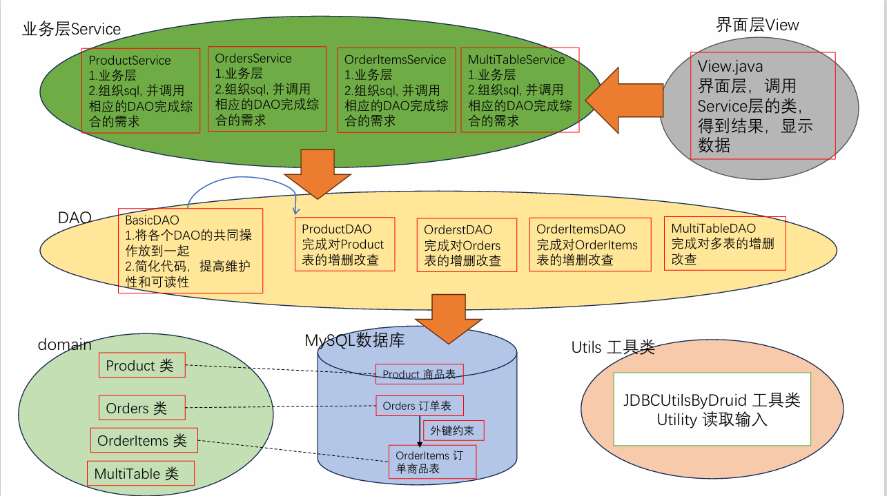

## 3. 功能实现
### 3.1 功能概览
通过命令行程序实现与数据库的交互
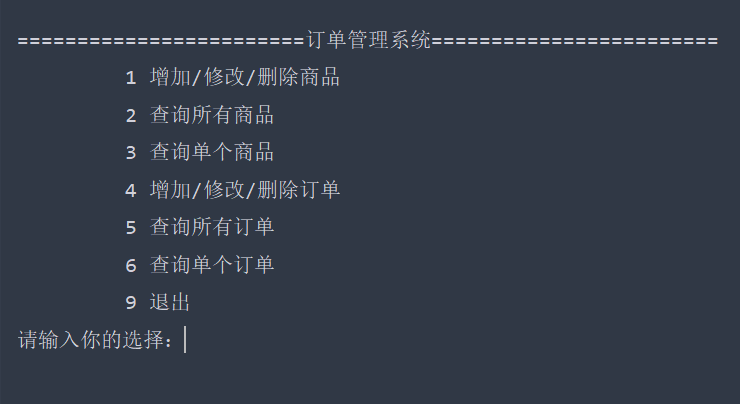

### 3.2 增加/修改/删除商品
增加商品：
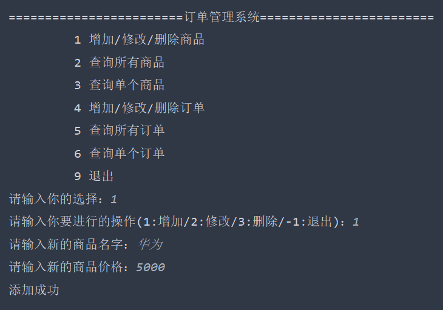
修改商品：
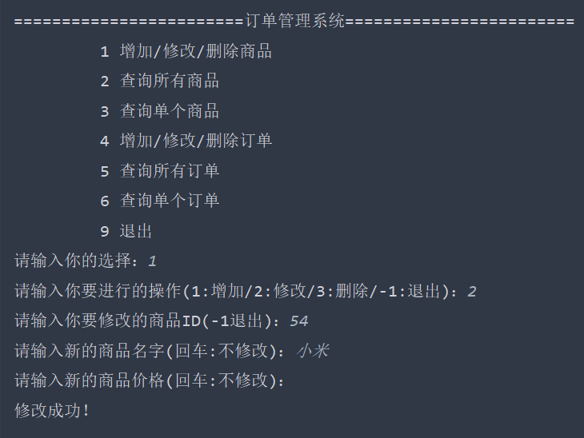
删除商品：
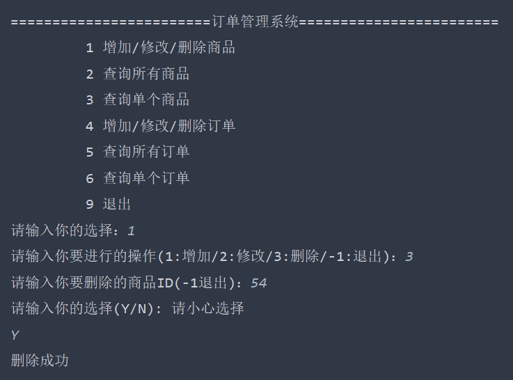

### 3.3 查询所有商品
实现分页查询、排序
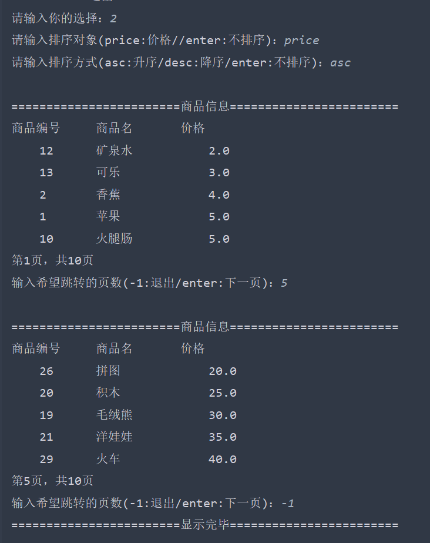

### 3.4 查询单个商品
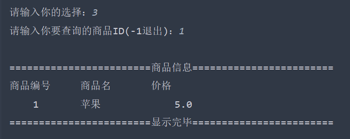

### 3.5 增加/修改/删除订单
实现事务管理
#### 3.5.1 增加一个订单
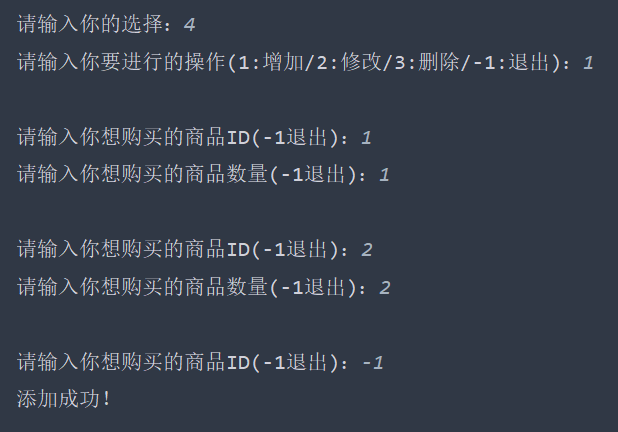

#### 3.5.2 修改订单信息
使用事务管理，实现了事务的隔离，提供事务回滚方法。

1): 增加一个商品信息
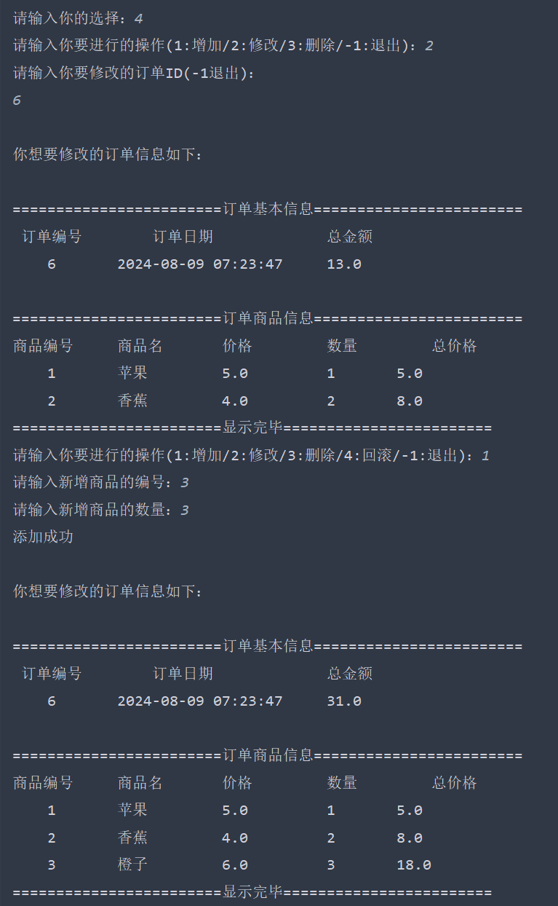

2): 修改一个商品信息，支持多次、实时修改
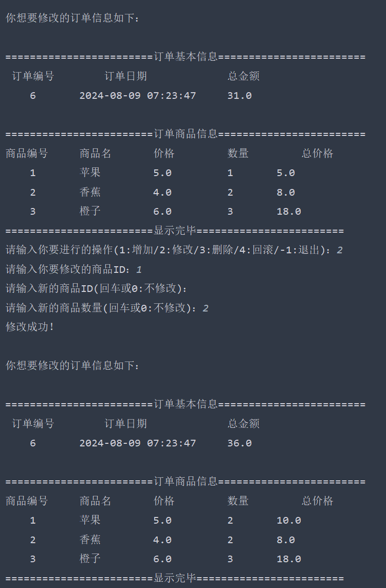

3): 删除一个商品信息
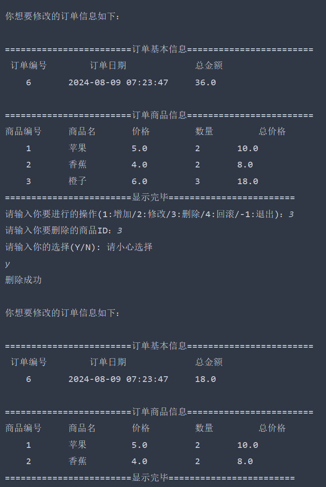

4): 事务回滚
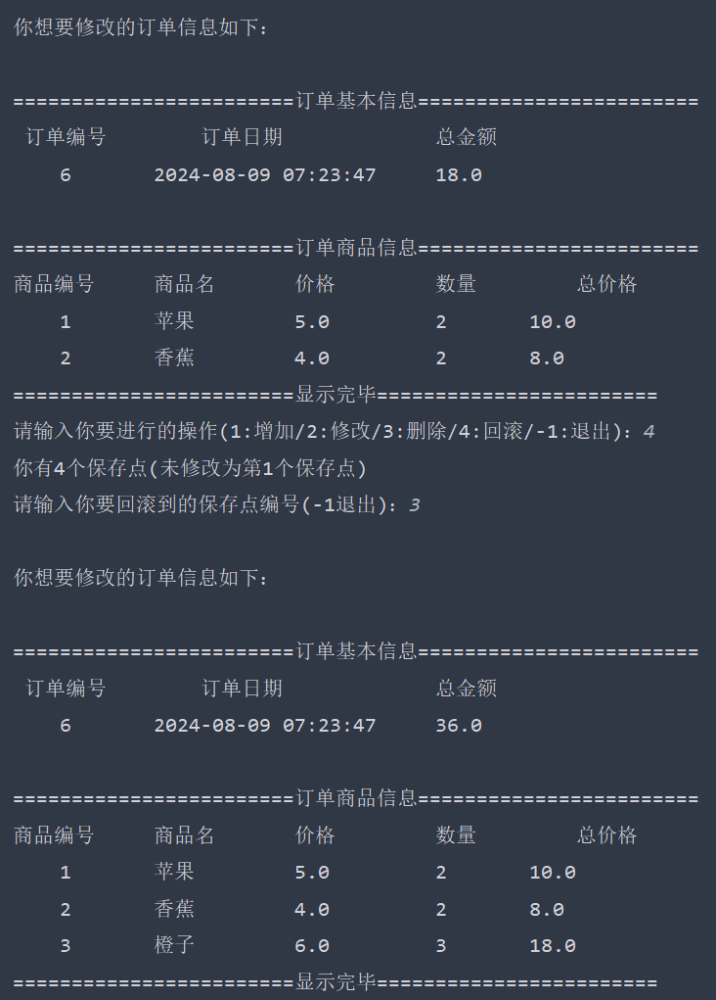

#### 3.5.3 删除一个订单
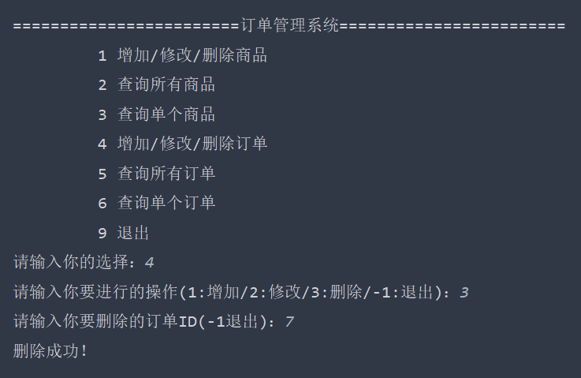

### 3.6 查询所有订单（显示订单基本信息）
实现分页查询(每页3个) + 排序
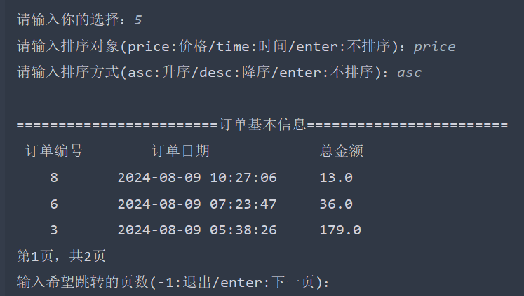

### 3.7 查询单个订单（显示订单详细信息）
运用多表查询
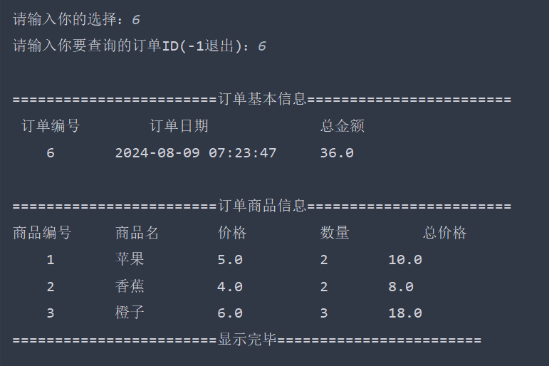

### 3.8 退出
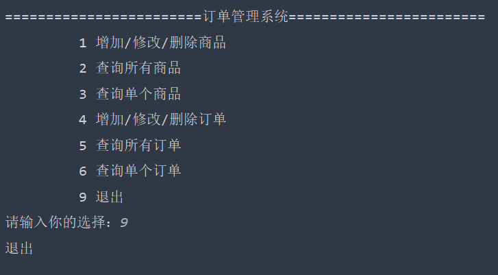

## 4. 心得体会
    这个项目的主要难点在于能否清晰地设计并实现表的构建和表与表相互之间的联系，
    以及能否熟练运用Java操作MySQL数据库。
    如果能够构建一个结构清晰的项目框架，独立且完整地实现这个项目仅仅是时间问题。

## 5. 问题解决
### 5.1 SQL 注入问题
    问题描述：SQL注入问题是利用某些系统没有对用户输入的数据进行充分检查，从而用户
             能够通过在输入数据中添加非法的SQL语句，恶意攻击数据库。
    问题解决：使用 PreparedStatement 代替 Statement
### 5.2 数据库内存泄漏
    问题描述：1．传统的JDBC数据库连接使用DriverManager 来获取，连接的时候都要将 Connection加载到内存中，再验证IP地址，用户名和密码(0.05s~1s时间)。
            需要数据库连接的时候，就向数据库要求一个，频繁的进行数据库连接操作将占用很多的系统资源，容易造成服务器崩溃。
            2．每一次数据库连接，使用完后都得断开,如果程序出现异常而未能关闭，将导致数据库内存泄漏，最终将导致重启数据库。
            3.传统获取连接的方式，不能控制创建的连接数量,如连接过多，也可能导致内存泄漏，MySQL崩溃。
    问题解决：使用数据库连接池技术 Druid（德鲁伊）